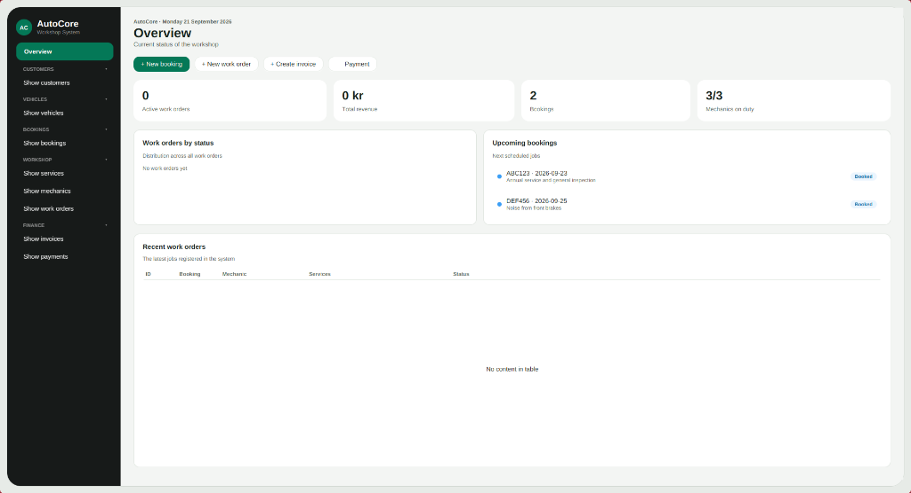

# AutoCore

AutoCore (Wigell AutoCore) är ett affärs- och verkstadssystem (Core ERP / Garage Management System) utvecklat för koncernen Wigell Group.

## Översikt
Systemet hanterar den dagliga operativa verksamheten på en bilverkstad:
- **Kunder & Fordon:** Registrering och koppling av ägare till fordon.
- **Bokningar:** Tidsbokning för service och felsökning.
- **Mekaniker & Tjänster:** Register över mekaniker, specialiteter och priskatalog för verkstadstjänster.
- **Arbetsordrar:** Hantering av arbetsordrar, tilldelning av mekaniker och statusflöde.
- **Fakturering & Rabattsystem:** Fakturering med stöd för VIP-rabatt och kampanjkoder.
- **Betalningar:** Betalningshantering via kort, Swish och kontant.

## Skärmbilder
JavaFX-gränssnittet (AutoCore, tema *Azure*):



## Teknisk stack
- Java (JDK 8, BellSoft Liberica Full med JavaFX)
- JavaFX-gränssnitt (GUI)
- Konsolgränssnitt (CLI)

## Kom igång & Synka med Develop

För att synka din lokala miljö med den gemensamma koden i `develop`:

```bash
# 1. Se till att du inte har osparade ändringar, växla sedan till develop
git checkout develop

# 2. Hämta och slå ihop alla senaste ändringar från teamet
git pull origin develop
```

> **Jobbar du i en egen feature-branch?**  
> Uppdatera din branch med det senaste från `develop`:
> ```bash
> git checkout din-feature-branch
> git merge develop
> ```

### Köra och testa applikationen

* **Huvudapplikationen (AutoCore GUI):** Kör `Main.java` i IntelliJ (eller via terminal: `./run.sh`)
* **Konsolversionen (CLI):** Kör `ConsoleApp.java` (eller via terminal: `./run.sh ConsoleApp`)
* **Modulvisa testappar:**
  - **Bokningar:** `com.wac.autocore.gui.booking.TestBookingApp`
  - **Arbetsordrar:** `com.wac.autocore.gui.workorder.TestWorkOrderApp`
  - **Fakturor:** `com.wac.autocore.gui.invoice.TestInvoiceApp`
  - **Betalningar:** `com.wac.autocore.gui.payment.TestPaymentApp`
  - **Mekaniker:** `com.wac.autocore.gui.mechanic.TestMechanicApp`
  - **Tjänster:** `com.wac.autocore.gui.serviceItem.TestServiceItemApp`

## Design & Styleguide
Projektets visuella riktlinjer, komponentbibliotek och de 5 färgteman finns sammanställda i den interaktiva styleguiden:
- [STYLEGUIDE.html](STYLEGUIDE.html) (öppnas i valfri webbläsare för live-förhandsgranskning och tematester)

## Utvecklingsteam
Grupp C: Alex, Lucas, Daniel, Vivianne
