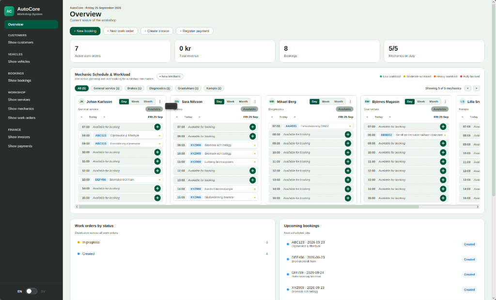

# AutoCore

AutoCore (Wigell AutoCore) är ett affärs- och verkstadssystem (Core ERP / Garage Management System) utvecklat för koncernen Wigell Group.

## Översikt
Systemet hanterar den dagliga operativa verksamheten på en bilverkstad:
- **Kunder & Fordon:** Registrering och koppling av ägare till fordon.
- **Bokningar:** Tidsbokning för service och felsökning.
- **Mekaniker & Tjänster:** Register över mekaniker, specialiteter och priskatalog för verkstadstjänster.
- **Arbetsordrar:** Hantering av arbetsordrar, tilldelning av mekaniker och statusflöde.
- **Fakturering & Rabattsystem:** Fakturering med stöd för VIP-rabatt och kampanjkoder.
- **Betalningar:** Betalningshantering via kort, Swish och kontant.

## Skärmbilder
JavaFX-gränssnittet (AutoCore, tema *Emerald*):



## Teknisk stack
- Java (JDK 8, BellSoft Liberica Full med JavaFX)
- JavaFX-gränssnitt (GUI)
- Konsolgränssnitt (CLI)

## Kom igång & Synka med Develop

För att synka din lokala miljö med den gemensamma koden i `develop`:

```bash
# 1. Se till att du inte har osparade ändringar, växla sedan till develop
git checkout develop

# 2. Hämta och slå ihop alla senaste ändringar från teamet
git pull origin develop
```

> **Jobbar du i en egen feature-branch?**  
> Uppdatera din branch med det senaste från `develop`:
> ```bash
> git checkout din-feature-branch
> git merge develop
> ```

### Köra och testa applikationen

* **Huvudapplikationen (AutoCore GUI):** Kör `./start.sh` i terminalen, eller `Main.java` i IntelliJ
* **Total systemaudit (50 kontroller):** Kör `./check.sh` (eller `./audit.sh`) för en komplett rapport över enhetstester, kodkvalitet, säkerhet och WCAG 2.1 AAA.
* **Snabba enhetstester:** Kör `./test.sh` (eller `com.wac.autocore.test.TestRunner`)
* **Konsolversionen (CLI):** Kör `./start.sh ConsoleApp` i terminalen, eller `ConsoleApp.java` i IntelliJ
* **Modulvisa testappar:**
  - **Kunder:** `com.wac.autocore.gui.customers.TestCustomer`
  - **Fordon:** `com.wac.autocore.gui.vehicle.VehicleTest`
  - **Bokningar:** `com.wac.autocore.gui.booking.TestBookingApp`
  - **Arbetsordrar:** `com.wac.autocore.gui.workorder.TestWorkOrderApp`
  - **Fakturor:** `com.wac.autocore.gui.invoice.TestInvoiceApp`
  - **Betalningar:** `com.wac.autocore.gui.payment.TestPaymentApp`
  - **Mekaniker:** `com.wac.autocore.gui.mechanic.TestMechanicApp`
  - **Tjänster:** `com.wac.autocore.gui.serviceItem.TestServiceItemApp`

> **Får du `No suitable driver found for jdbc:sqlite`?**
> Databasdrivrutinen ligger som ett projektberoende i `.idea/libraries/`, så den följer med i giten.
> Felet betyder i så fall att din IntelliJ kör med en gammal projektmodell: välj
> **File → Reload All from Disk**, eller stäng och öppna projektet igen.
> Går det ändå inte, lägg till `WigellAutoCore/autocore/lib/sqlite-jdbc-3.53.4.0.jar` manuellt via
> **File → Project Structure → Modules → Dependencies → `+` → JARs or directories**.
> `./start.sh` behöver inget av detta.

## Arkitektur & Modularisering

Systemet är uppbyggt enligt ren skiktad arkitektur (Layered Architecture) och SOLID-principerna:

```
WigellAutoCore/autocore/
├── lib/
│   └── sqlite-jdbc-3.53.4.0.jar      # Databasdrivrutin för lokal SQLite-persistens
├── src/
│   ├── Main.java                     # JavaFX GUI Startpunkt
│   ├── ConsoleApp.java               # Textbaserat CLI-gränssnitt
│   └── com/wac/autocore/
│       ├── data/
│       │   └── Database.java         # Datalager & seed data (förberett för SQLite)
│       ├── model/                    # Domänmodeller (Customer, Vehicle, Booking, etc.)
│       ├── service/                  # Servicelager & Fasad
│       │   ├── GarageSystem.java     # Huvudfasad (Facade Pattern) mot delsystem
│       │   ├── CustomerService.java  # Kundhantering & validering
│       │   ├── VehicleService.java   # Fordonsregistrering & ägarkoppling
│       │   ├── BookingService.java   # Tidsbokning & validering
│       │   ├── WorkOrderService.java # Arbetsorderns livscykel (CREATED -> IN_PROGRESS -> COMPLETED)
│       │   ├── BillingService.java   # Fakturaberäkning, rabatter & momshantering
│       │   ├── PaymentService.java   # Betalningstransaktioner (Kort, Swish, Kontant)
│       │   └── MechanicSchedule.java # Schemaläggning & beläggningsberäkning (timme-för-timme)
│       ├── ui/                       # Presentationslager (JavaFX GUI)
│       │   ├── AutoCoreApp.java      # Fönsterram, layout & sidnavigation
│       │   ├── ActionDialogs.java    # Lättviktig fasad (Facade) för modala formulärdialoger
│       │   ├── CustomerDialogs.java  # Kunddialoger (skapa, redigera, ta bort)
│       │   ├── VehicleDialogs.java   # Fordonsdialoger (skapa, redigera, ta bort)
│       │   ├── BookingDialogs.java   # Bokningsdialoger (tjänst, mekaniker, arbetspass)
│       │   ├── WorkOrderDialogs.java # Arbetsorderdialoger med tjänstekoppling
│       │   ├── BillingDialogs.java   # Faktura- och betalningsdialoger
│       │   ├── MechanicDialogs.java  # Mekanikerdialoger (specialisering, tillgänglighet)
│       │   ├── ServiceItemDialogs.java # Verkstadstjänster & prissättning
│       │   ├── SlotDetailsDialog.java # Detaljdialoger för schema- och arbetsordrar
│       │   ├── components/           # Återanvändbara UI-komponenter & Kanban-kort
│       │   ├── i18n/                 # Flerspråksmotor (I18n.java) med realtidsväxling
│       │   ├── navigation/           # Sidomeny (SidebarView) & Sidrouter (PageRouter)
│       │   ├── util/                 # Formatering (UiFormatters), sök och uppslag
│       │   └── views/                # Översikt, Dashboard och entitetsvyer
│       └── test/                     # Automatiserad testsvit (54 tester)
└── resources/
    └── com/wac/autocore/
        ├── i18n/                     # Dictionaries (sv.json, en.json) med 100% paritet
        └── theme/                    # CSS-designsystem & officiellt tema (Emerald)
```

### Flerspråksstöd i realtid (SV / EN)
* **Realtidsväxling:** Växla sömlöst mellan svenska och engelska med knappen i sidomenyn utan att behöva starta om applikationen.
* **100 % Nyckelparitet:** Både `sv.json` och `en.json` innehåller samtliga 396 språknycklar för menyer, dialoger, tabeller, statusar och felmeddelanden.
* **Dynamisk formatering:** Datum formateras automatiskt på rätt språk (t.ex. *"Måndag 23 september 2026"* vs *"Monday 23 September 2026"*) och statusord mappas via `UiFormatters`.

### Ren Sidomenynavigering (SidebarView)
* **Permanent Sidebar:** Navigeringen är uteslutande placerad i den vänstra sidomenyn med tydlig sektionsindelning, mjuka hover-effekter och integrerad språkväxlingsknapp.
* **Granulär tabellsökning:** Samtliga entitetsvyer har integrerad filtrering och sökning via `TableFactory` med omedelbar filtrering över alla kolumner.

### Interaktiv Mekaniker-Kanban & Schemaläggning (MechanicKanbanCard)
Översiktspanelen (`OverviewView`) innehåller en fullt interaktiv, realtidsstyrd Kanban-tavla för verkstadens mekaniker:
* **Trelägesvyer (Dag, Vecka, Månad):**
  - **Dagsvy (07:00–16:00):** Visar 9 distinkta timboxar. Lediga tider har en klickbar SVG-plusknapp (`+`) som öppnar bokningsdialogen direkt förvald på mekanikern och vald timme.
  - **Inline Drawer:** Ett klick på en bokad timme fäller mjukt ut en inline detaljlåda under slotten med fordonets registreringsnummer, kundnamn och fullständig arbetsorderbeskrivning.
  - **Veckovy & Beläggningsgrad:** 7-dagarsvy med färgkodad 4-stegs belastningsprogression:
    - 🟢 **Ledig (0–2 h):** Grön belastningsindikator.
    - 🟡 **Måttlig (3–4 h):** Gul belastningsindikator.
    - 🟠 **Hög (5–6 h):** Orange belastningsindikator.
    - 🔴 **Fullbokad (7+ h):** Röd belastningsindikator.
  - **Månadsvy:** Interaktiv månadskalender som visualiserar tjänstgöringsdagar och tillgänglighet för framtida bokningar.
* **Smart Snabbnavigering till nästa bokning:**
  - Om mekanikern saknar bokade timmar på vald dag visas en klickbar genväg (`📅 Nästa bokning: [Dag] [Datum] →`) som med ett klick hoppar direkt till nästa dag då mekanikern har ett inbokat arbete.
* **Kontextuell Kebabmeny (`⋮`):**
  - Diskret 3-prickars meny uppe till höger på varje mekanikerkort med alternativ för:
    - **Redigera mekaniker:** Uppdatera namn, specialisering och tillgänglighet via modal dialog.
    - **Ta bort mekaniker:** Raderar mekanikern ur systemet, skyddad av en säkerhetsspärr i `GarageSystem` som förhindrar borttagning om mekanikern har pågående aktiva arbetsordrar.
* **Realtidssynkronisering mot SQLite-databasen:**
  - `MechanicSchedule.syncFromDatabase()` läser automatiskt in aktiva arbetsordrar från SQLite (`work_orders`, `bookings`, `vehicles`, `customers`) och mappar in dem i lediga timluckor. Nya arbetsordrar syns direkt utan omstart.
* **Filtrering & Horisontell Navigering:**
  - Snabbfilter för mekanikernas specialiseringar (t.ex. *Motor*, *Bromsar*, *El & Diagnostik*) och horisontella rullningskontroller (`<`, `>`) som möjliggör smidig hantering av obegränsat antal mekaniker utan layout-hopp.
* **Plattforms- & Tillgänglighetsoptimerad:**
  - Vektorbaserade `SVGPath`-ikoner, standardiserade Unicode-pilar (`<`, `>`, `\u25BC`) och justerad typografi förhindrar avhuggna symboler och överlappande text på macOS. Fullt förenlig med WCAG 2.1 AAA.

### Automatiserade tester & Audit (`com.wac.autocore.test`)
Systemet skyddas av **54 automatiserade tester och kvalitetskontroller** samt automatisk GitHub Actions CI:
* **`GlobalSearchTest`**: Verifierar granulär sökning över kunder, fordon, mekaniker, ordrar, skiftlägesokänslighet och prefix.
* **`TableFactoryTest`**: Verifierar flerkolumnssökning och regressionsskyddar mot indexbuggar vid filtrering.
* **`UiFormattersTest`**: Valuta (long/double), trunkering, statusöversättning, datum och badge-CSS-klasser.
* **`EntityLookupTest`**: Uppslagning mot `GarageSystem` för kundnamn, fordonsreg, mekaniker och tjänster.
* **`OverviewMetricsTest`**: Verifiering av KPI-mätetal (aktiva ordrar, omsättning, tillgänglighet).
* **`I18nTest`**: Språkväxling i realtid, parameteriserade strängar, fallback och komplett paritet mellan språkfiler.
* **`MechanicScheduleTest`**: Dagslots, veckobelastning, färgprogression, skydd mot dubbelbokningar och `getNextBookingDate`.
* **`PersistenceRestartTest`**: Säkerställer att sparade kunder och bokningar bevaras i SQLite och överlever app-omstart utan dubblering.
* **`CodeQualityTest`**: 100% språkparitet, temaintegritet, frikoppling av servicelager och komplexitetsgränser (< 1200 rader).
* **`SecurityAuditTest`**: Skanning mot hårdkodade hemligheter, SQL-injektionsmönster, processkörning och PII-loggning.
* **`WcagAccessibilityTest`**: WCAG 2.1 AAA kontrastmätningar (>= 7.0:1 för normal text, >= 4.5:1 för UI), fokusindikatorer och minsta teckenstorlek.
* **GitHub Actions CI (`.github/workflows/ci.yml`)**: Körs automatiskt vid varje push/PR med Liberica JDK 8 (med JavaFX) och virtuell framebuffer (`xvfb-run`).
* **Kör tester:**
  - `./check.sh` för komplett grafisk auditrapport (Alla 4 moduler, 50 kontroller).
  - `./test.sh` för snabb enhetstestkörning (54 tester).

### UI & Tillgänglighet (WCAG 2.1 AAA)
* **Zebramönstrade tabeller:** Varannan rad har dämpad kontrastfärg för snabbare och behagligare läsning.
* **Luftig och ren sidomeny:** Tydliga sektionsrubriker med 22 px avstånd och inga förvirrande dragspelsprickar.
* **Naturlig textvisning i schemat:** Kanban-kortens tidsrader expanderar naturligt och klipper endast med `…` när texten når kanten.
* **Färgtema (Emerald - Level AAA):** Designsystemet är låst till det officiella temat **`emerald`** med skarp grafitgrå list på tabeller och ultrahög kontrast (7.0:1 till 16.5:1) som uppfyller WCAG 2.1 Level AAA.
* **Tangentbordsfokus (WCAG 2.4.7):** Tydliga `:focused`-stilar och fokusringar på alla interaktiva kontroller.

## Design & Styleguide
Projektets visuella riktlinjer, komponentbibliotek och färgteman finns sammanställda i den interaktiva styleguiden:
- [STYLEGUIDE.html](STYLEGUIDE.html) (öppnas i valfri webbläsare för live-förhandsgranskning och tematester)

## Utvecklingsteam
Grupp C: Alex, Lucas, Daniel, Vivianne
