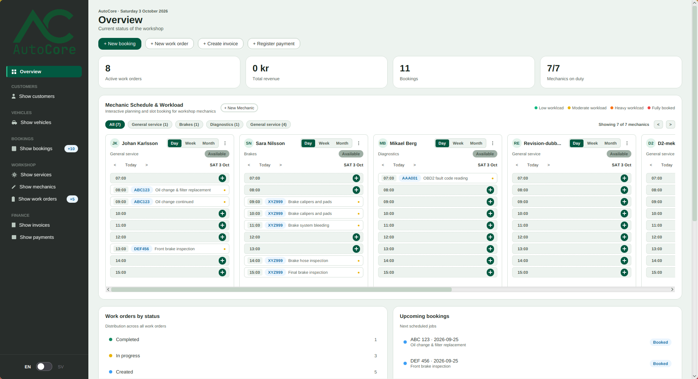
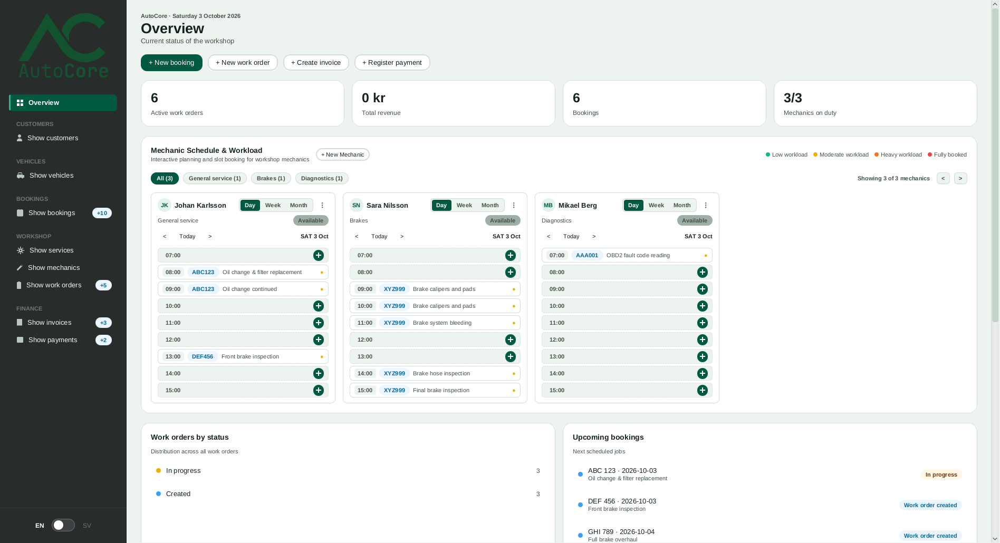

# AutoCore

Ett verkstadssystem för Wigell Group. Kunder, fordon, bokningar, arbetsordrar, fakturor och betalningar, med ett JavaFX-gränssnitt och SQLite lokalt.

## Vad systemet gör

- Kunder och fordon, med ägarkoppling.
- Bokningar med en eller flera tjänster, tidsberäkning och skydd mot överlapp.
- Mekaniker med specialisering, schema och belastning.
- Tjänstekatalog med pris och beräknad tid.
- Arbetsordrar med statusflöde från skapad till klar.
- Fakturor med flera rader, rabatt och moms.
- Betalning via kort, Swish eller kontant.



Siffrorna i menyn visar vad som väntar på hantering. Bilden är ett exempel.



## Bygg och kör

Projektet använder Java 8 med JavaFX. Starta appen med `./start.sh`, eller kör
`Main.java` från IntelliJ. Konsolversionen startar du med `./start.sh ConsoleApp`.
```bash
git checkout din-gren
git merge develop
```

### Får du "No suitable driver found for jdbc:sqlite"?

Drivrutinen ligger i `.idea/libraries/` och följer med i giten. Felet betyder att IntelliJ kör en gammal projektmodell: välj **File → Reload All from Disk**, eller stäng och öppna projektet. Går det inte, lägg till `WigellAutoCore/autocore/lib/sqlite-jdbc-3.53.4.0.jar` under **File → Project Structure → Modules → Dependencies**. `./start.sh` behöver inget av det.

Körningen behöver en bildskärm. Saknas den, sätt `GDK_BACKEND=x11` och en `DISPLAY`, annars stannar JavaFX.

## Arkitektur

```
WigellAutoCore/autocore/
├── lib/            sqlite-jdbc
├── src/
│   ├── Main.java           JavaFX-appen
│   ├── ConsoleApp.java     Konsolversionen
│   └── com/wac/autocore/
│       ├── data/           Databasen och demodata
│       ├── model/          Domänmodeller
│       ├── repository/     Läsning och skrivning mot SQLite
│       ├── service/        Affärslogik, GarageSystem som fasad
│       ├── seed/           Ordlista för demodata, svenska och engelska
│       ├── test/           Den automatiska sviten
│       └── ui/             Gränssnittet: dialoger, vyer, komponenter,
│                           i18n och teman
└── resources/
    └── com/wac/autocore/
        ├── i18n/           sv.json och en.json
        ├── seed/           Demodata per språk
        └── theme/          CSS och temat Emerald
```

Lagren går i en riktning: gränssnittet pratar med `GarageSystem`, som pratar med serviceklasserna, som pratar med repositoryt. Ingen genväg förbi.

### Bokning och arbetsorder

En bokning registreras som `BOOKED` och skapar ingen arbetsorder. Arbetsordern skapas först när fordonet lämnas in, från Kanban-vyn eller arbetsorderdialogen.

Bokningsdialogen visar lediga och upptagna timmar per mekaniker. Tjänsternas tider summeras, så en bokning som sträcker sig över flera timmar kan inte läggas ovanpå en annan. Avbokar du en bokning frigörs tiderna direkt.

Mekanikerns behörighet hänger på en nyckel. Tjänsten anger vilken specialisering den kräver, och en tjänst utan krav kan utföras av alla.

### Schemat

Översikten har en Kanban-tavla per mekaniker med dag, vecka och månad. Dagen visar nio timmar mellan 07:00 och 16:00, lediga timmar går att boka direkt, och ett klick på en bokad timme fäller ut detaljer om fordon, kund och arbetsorder. Veckovyn färgkodar belastningen i fyra steg.

### Språk

Svenska och engelska byts med knappen i menyn, utan omstart. Datum, statusord och valutor följer språket. Kvalitetskontrollen kräver att språkfilerna har exakt samma uppsättning nycklar.

## Dokumentation

- [`ACCEPTANSKRAV.md`](ACCEPTANSKRAV.md): de funktionella kraven för systemet.

## Team

Grupp C: Alex, Lucas, Daniel.
